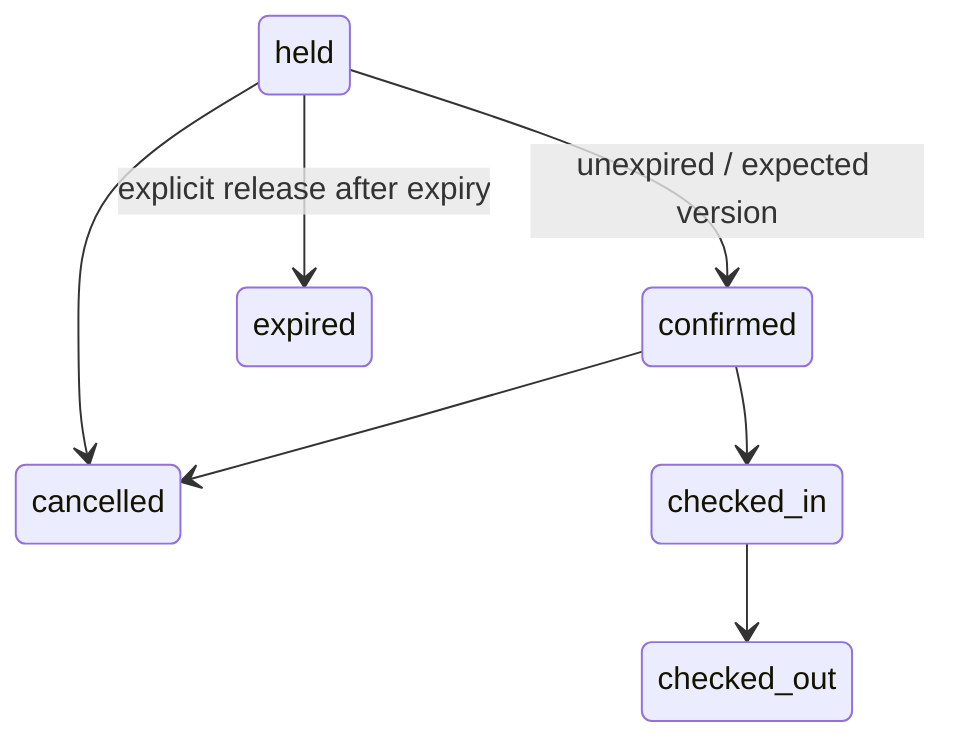

# Hospitality inventory and reservations

This is the first operational lodging slice of the home-grown open-source service. Seven NoETL playbooks add individual room inventory, availability/quotes, 15-minute holds, staff confirmation/cancellation, check-in/check-out, private reservation reads, and expired-hold release. All business operations remain bound SQL inside YAML, executed by the existing Rust PostgreSQL tool. There is no Python backend or payment simulator.

## Model and migration

Apply `adiona/v1/provision`, then `adiona/v1/lodging_provision` with `adiona_migrator`. The second playbook takes the same migration advisory lock, requires the known version-1 checksum, installs version 2 atomically, and records its own checksum. Reapplication preserves records; edited ledger checksums fail. Version 1 is unchanged. Reset remains the separate validation-only playbook and drops these tables with the rest of the Adiona schema.

`adiona.lodging_units` represents an individually allocated room, cabin, campsite or similar unit. Its `(item_id,provider_id)` foreign key references the existing MySQL-derived Adiona catalog. Multiple units can refer to one item; non-lodging catalog items need no units. Provider/unit-code is unique. Capacity, nightly rate, currency and active flag can change; an established unit cannot change item or provider. Deactivate inventory instead of deleting referenced history.

`adiona.reservations` references a unit and an existing Adiona guest user. New guest creation still requires the authorized user-administration path; staff do not gain access to other users' profile data. Reservations snapshot the unit's nightly rate/currency and compute exact integer totals for 1–365 nights. This initial rate is flat per night, without taxes, fees or discounts. Currency minor-unit interpretation is a deployment responsibility; use currencies with two decimal places for the `*_cents` contract until a currency-exponent model exists.

Adiona's MySQL `orders/customer_order_tables.sql` has generic orders, item-linked lines and payment invoice fields. Those are not a dated room allocation model. The new tables extend the migrated catalog rather than silently reinterpreting legacy orders, invoices or payment state. Historical orders/import and the source specialized travel availability rules remain separate migration work.

## Playbook contract

All requests use `{"request":{...}}`. Dates are finite ISO dates with checkout exclusive (`[arrival,departure)`). Staff enter business-local stay dates explicitly; this release has no property timezone or automatic check-in clock policy. Check-in/out are explicit staff actions, including early departure and historical corrections; no wall-clock date restriction is implied.

| Path suffix under `adiona/v1/` | Request | Result |
|---|---|---|
| `lodging_provision` | `{}`; migrator only | Apply/check migration 2 after migration 1 |
| `lodging_unit_upsert` | `provider_id,item_id,unit_code,capacity,nightly_rate,currency_code`, optional `active` (default true) | Stable unit ID; supplied fields replace existing values |
| `lodging_availability` | `arrival,departure,guests`, optional `item_id` | At most 100 active available units, ordered by ID, with flat nightly quotes |
| `reservation_hold` | `unit_id,guest_id,arrival,departure,guests,idempotency_key` | Held reservation with rate snapshot and server-chosen expiry |
| `reservation_get` | `reservation_id` | Visible reservation or no rows |
| `reservation_transition` | `reservation_id,status,expected_version` | New/current state and version; stale or invalid transition fails |
| `reservation_release_expired` | `{}` | Expired holds belonging to the actor's authorized scope |

IDs and monetary values in these result objects are decimal **strings**, preserving bigint precision in browser clients. Capacity, nights and optimistic version are numbers. Missing/inaccessible unit or reservation targets return zero rows; clients must not treat an empty result as successful creation. Constraint failures fail the NoETL execution. Input remains base64-encoded JSON passed as a bound parameter through the existing rendering pipeline.

Example sequence (supply actual catalog/provider/guest IDs):

```json
{"request":{"provider_id":"1","item_id":"42","unit_code":"101","capacity":2,"nightly_rate":"12500","currency_code":"USD"}}
```

```json
{"request":{"unit_id":"1","guest_id":"3","arrival":"2030-05-01","departure":"2030-05-04","guests":2,"idempotency_key":"front-desk-2030-001"}}
```

```json
{"request":{"reservation_id":"1","status":"confirmed","expected_version":1}}
```

Confirmation records a staff booking decision. It does **not** charge a card or assert payment. The valid transitions are:



Repeating the current target state returns the same version/timestamp. Other transitions require the exact current version. Terminal reservations cannot be revived. Cancellation and checkout release allocation while retaining the reservation row; this is not yet a complete event/audit ledger or financial cancellation policy.

## Concurrency and authorization

A partial PostgreSQL GiST exclusion constraint rejects overlapping active reservations for each unit. Two native ranges encode unit identity and stay dates, so no `btree_gist` extension is needed. Adjacent stays are allowed. An availability quote does not reserve inventory; the hold statement is authoritative. A shared unit lock stabilizes active/capacity/rate during creation. Competing holds cannot both commit.

A provider-scoped idempotency key is permanent. Repeating the same unit/guest/dates/guest count returns the original reservation, including its price, expiry and terminal state. Reusing it with different booking details fails. A retry never extends expiry, reprices the booking or revives a cancelled reservation. Use a new key for a genuinely new booking. Retry the whole operation for SQLSTATE `40001`/`40P01` with bounded backoff. Exclusion conflict `23P01`, invalid input and authorization failures need a new user decision, not blind retries.

Elapsed time does not remove an exclusion constraint. Expired holds remain unavailable until `reservation_release_expired` commits. Schedule that playbook with trusted provider credentials (or a reviewed administrator job). Scheduling is not enabled by this repository; delayed cleanup safely reduces availability rather than overselling. Release and confirmation compete through normal row locking/serialization.

Provider credentials can manage only their own units/reservations. Guests can read only their own reservations and cannot hold, quote or change inventory. Administrators may manage all providers. RLS and the composite ownership foreign keys enforce this scope, including direct SQL. Runtime roles cannot edit reservation guest/dates/price/expiry or delete reservation history. Lifecycle rules are in the reviewed YAML; privileged workflow administrators must not give users arbitrary SQL execution or credential access. No shared administrator credential should be exposed to a browser.

## Local validation and next stages

After the catalog integration suite, run:

```bash
node adiona/tests/hospitality.mjs
# Start the documented local Rust server/worker, then:
node adiona/tests/runtime.mjs
node adiona/tests/hospitality.mjs --runtime
```

Use `PSQL` if PostgreSQL 19's client is outside PATH. The tests verify the package's local data directory, use synthetic fixtures, and deliberately alter one expiry/ledger through the test owner to exercise failure paths. Run the catalog integration suite first to reset fixtures before each complete rerun. Tests issue real SQL and real runtime executions; evidence is in `hospitality-tool-results.json` and `hospitality-runtime-results.json`.

The next service stages are a verified-identity gateway and front-desk UI, property/timezone setup, seasonal rates/taxes/fees, reservation event history/outbox, payment reconciliation/refunds, housekeeping and maintenance blocks, and channel synchronization. Public self-service booking, multi-room atomic group reservations, availability pagination, production scheduling, and final PostgreSQL 19 release qualification are not implemented here.
