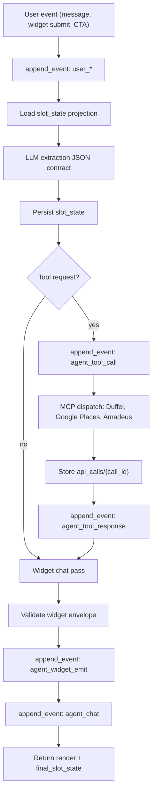

# Agent Design

Muno's itinerary planner is a one-event-at-a-time NoETL playbook at
`playbooks/itinerary-planner.yaml`. It is intentionally separate from the
one-shot travel flagship runtime in `repos/ops`: Muno owns multi-turn chat
state, widget submissions, and trip-specific projections.

## Per-Turn Loop



Each invocation processes exactly one input event. The caller supplies
`thread_id`, `event_type`, and `event_payload`; if no thread id is supplied,
the playbook creates a smoke-safe id under `chat_threads/_smoke-*`.

## Slot State

The current projection is stored at
`chat_threads/{thread_id}/slot_state/current`. The projection is not the
source of truth; it is a convenience view rebuilt from the append-only event
log when needed.

Core fields:

| Field | Meaning |
| --- | --- |
| `region` | Destination object `{label, country_code, city_code, kind}`. |
| `check_in_date`, `check_out_date`, `nights` | ISO date range and derived night count. |
| `party` | `{rooms, adults, children: [{age}]}`. |
| `star_rating_min`, `budget_min`, `budget_max`, `bed_type`, `amenities_required` | Hotel filters. |
| `flight_search_results`, `picked_flight_offer_id` | Last flight result ids and selected offer. |
| `hotel_search_results`, `picked_hotel_id` | Last hotel result ids and selected hotel. |
| `total_results_seen`, `matching_with_current_filters` | Counts used for filter nudges. |
| `total_cost` | Computed itinerary total for the summary widget. |

## Tool Dispatch

The extraction pass returns a JSON object with `slot_updates`,
`tool_requests`, and `render_intent`. The runtime dispatches at most one tool
request per turn in this first cut.

| Condition | Tool | Notes |
| --- | --- | --- |
| Destination newly identified or ambiguous | `mcp/google-places.search_text` | Enriches destination context and future map widgets. |
| Region, dates, and party are complete | `mcp/duffel.search_offers` | Test environment only; `flight_provider` defaults to Duffel. |
| Flight selected and hotels are missing | `mcp/amadeus.search_hotels` | Hotels are locked to Amadeus until Duffel Stays is commercially enabled. |
| User confirms a synthetic offer | `mcp/duffel.create_order` | Test wallet balance only; no live orders. |
| Projection or event writes | `mcp/firestore.*` | Event writes always use `append_event` so header redaction is mandatory. |

Production endpoints are forbidden in this agent. `duffel_env` and
`amadeus_env` remain `test`; the LLM prompt explicitly disallows overriding
them.

## Widget Contract

The chat pass emits widget envelopes from the closed catalogue under
`playbooks/widget-contract/`. The playbook validates the envelope shape before
writing `agent_widget_emit`. The frontend validates again at render time with
the same schemas. If a generated envelope is malformed, the runtime swaps it
for `bot_text` rather than storing an invalid widget.

Canonical examples live in
`playbooks/agent/widget_envelope_examples.md`. Round 6b uses that file as the
fixture source for the real Material components.

## Replay Mode

Replay mode is enabled with:

```yaml
replay: true
replay_thread_id: chat_threads/<id>
```

In replay mode, the agent reads recorded tool responses from
`chat_threads/{thread_id}/api_calls/{call_id}` instead of making live provider
calls. LLM calls run with `temperature: 0` and the model version recorded on
each event. Natural-language chat text may drift, but replay compares these
stable signals:

- `agent_slot_update` payloads.
- The sequence of emitted `widget_type` values.
- Tool request order and arguments after redaction.

Replay is therefore a drift detector, not a byte-for-byte transcript lock.

## Error Handling

Tool failures append `agent_tool_response` with `error: true` and render an
`error_card`. The conversation keeps going: the user can retry, change filters,
or skip the failed provider.

Firestore write failures are the only hard failures because the event log is
the source of truth. Widget validation failures are soft failures and downgrade
to `bot_text`.
